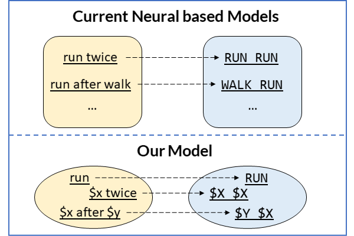

# :mailbox: Paper Code Collection (MSRA DKI Group)

This repo hosts multiple open-source codes of the [Microsoft Research Asia DKI Group](https://www.microsoft.com/en-us/research/opportunity/data-analytics-intern-msra-dki/). You could find the corresponding code as below:

1. (:coffee: Released on Oct. 2020) **[Compositional Generalization by Learning Analytical Expressions](compositional_generalization)**

    

    *Compositional generalization is a basic but essential intellective capability of human beings, which allows us to recombine known parts readily. However, existing neural network based models have been proven to be extremely deficient in such a capability. Inspired by work in cognition which argues compositionality can be captured by variable slots with symbolic functions, we present a refreshing view that connects a memory-augmented neural model with analytical expressions, to achieve compositional generalization. Our model consists of two cooperative neural modules Composer and Solver, fitting well with the cognitive argument while still being trained in an end-to-end manner via a hierarchical reinforcement learning algorithm. Experiments on a well-known benchmark SCAN demonstrate that our model seizes a great ability of compositional generalization, solving all challenges addressed by previous works with 100% accuracies.*

1. (:hourglass_flowing_sand: To be Released on Oct. 2020) **[Incomplete Utterance Rewriting as Semantic Segmentation](incomplete_utterance_rewriting)**

    *Recent years the task of incomplete utterance rewriting has raised a large attention. Previous works usually shape it as a machine translation task and employ sequence to sequence based architecture with copy mechanism. In this paper, we present a novel and extensive approach, which formulates it as a semantic segmentation task. Instead of generating from scratch, such a formulation introduces edit operations and shapes the problem as prediction of a word-level edit matrix. Benefiting from being able to capture both local and global information, our approach achieves state-ofthe-art performance on several public datasets. Furthermore, our approach is four times faster than the standard approach in inference.*

1. (:hourglass_flowing_sand: To be Released on Oct. 2020) **["What Do You Mean by That?" A Parser-Independent Interactive Approach for Enhancing Text-to-SQL](interactive_text_to_sql)**

    *In Natural Language Interfaces to Databases (NLIDB) systems, the text-to-Structured Query Language (SQL) technique allows users to query databases by using natural language questions. Though significant progress in this area has been made recently, most parsers may fall short when they deal with real systems. One main reason stems from the difficulty of fully understanding the user's natural language questions. In this paper, we include human in the loop and present a novel parser-independent interactive approach (PIIA) that interacts with users using multi-choice questions and can easily work with arbitrary parsers. Experiments were conducted on two cross-domain datasets, the WikiSQL and the more complex Spider, with five state-of-the-art parsers. These demonstrated that PIIA is capable of enhancing the text-to-SQL performance with limited interaction turns by using both simulation and human evaluation.*

1. (:coffee: Released on Apr. 2020) **[How Far are We from Effective Context Modeling ? An Exploratory Study on Semantic Parsing in Context](semantic_parsing_in_context)**

    *Semantic parsing in context is challenging since there are complex contextual phenomena. Previous works verified their proposed methods in limited scenarios, which motivates us to conduct an exploratory study on context modeling methods under real-world semantic parsing in context. We present a grammar-based decoding semantic parser and adapt typical context modeling methods on top of it. We evaluate 13 context modeling methods on two large complex cross-domain datasets, and our best model achieves state-of-the-art performances on both datasets with significant improvements. Furthermore, we summarize the most frequent contextual phenomena, with a fine-grained analysis on representative models, which may shed light on potential research directions.*

## Contributing

This project welcomes contributions and suggestions.  Most contributions require you to agree to a
Contributor License Agreement (CLA) declaring that you have the right to, and actually do, grant us
the rights to use your contribution. For details, visit https://cla.opensource.microsoft.com.

When you submit a pull request, a CLA bot will automatically determine whether you need to provide
a CLA and decorate the PR appropriately (e.g., status check, comment). Simply follow the instructions
provided by the bot. You will only need to do this once across all repos using our CLA.

This project has adopted the [Microsoft Open Source Code of Conduct](https://opensource.microsoft.com/codeofconduct/).
For more information see the [Code of Conduct FAQ](https://opensource.microsoft.com/codeofconduct/faq/) or
contact [opencode@microsoft.com](mailto:opencode@microsoft.com) with any additional questions or comments.

## Question

If you have any question or find any bug, please go ahead and [open an issue](https://github.com/microsoft/ContextualSP/issues). Issues are an acceptable discussion forum as well.

If you want to concat the author, please email: qian DOT liu AT buaa.edu.cn 
