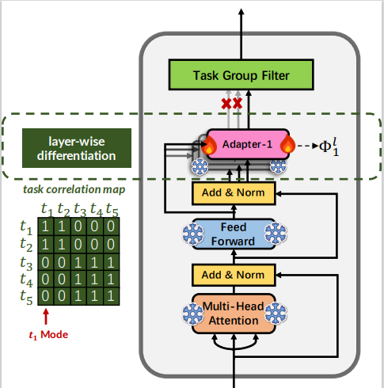

<h1 align="center"> AdapterShare: Task Correlation Modeling with Adapter Differentiation </h1>

<div align=center></div>

## Introduction
Thanks to the development of pre-trained language models, multitask learning (MTL) methods have achieved great success in natural language understanding. However, current MTL methods pay more attention to task selection or model design to fuse as much knowledge as possible, while the intrinsic task correlation is often neglected. It is important to learn sharing strategies among multiple tasks rather than sharing everything. In this paper, we propose AdapterShare, an adapter differentiation method to explicitly model task correlation among multiple tasks. AdapterShare is automatically learned based on the gradients on tiny held-out validation data. Compared to single-task learning and fully shared MTL methods, our proposed method obtains obvious performance improvements. Compared to the existing MTL method AdapterFusion, AdapterShare achieves an absolute average improvement of 1.90 points on five dialogue understanding tasks and 2.33 points on NLU tasks.

## Quickstart

### Setup Environment
#### Install via pip:
1. install requirements </br>
   ```> pip install -r requirements.txt```

2. install our modified `adapters` package </br>
   ```> pip install git+https://github.com/WowCZ/adapter-transformers.git```


#### prepare the nlu dataset:
1. Download data </br>
   ```> sh download.sh``` </br>
   Please refer to download GLUE dataset: https://gluebenchmark.com/

2. Preprocess data </br>
   ```> sh experiments/glue/prepro.sh```


### Training scripts:
1. Individual training script (baseline multitask learning): </br>
    ```> sh scripts/adapter_train.sh -tr wnli -te wnli -ls 50 -ss 100  > LOGS/mtnlu_wnli.log``` </br>

2. AdapterShare training script: </br>
    ```> sh scripts/adapter_train.sh -tr mnli,cola,qnli,qqp,rte,sst,stsb,wnli -te mnli_matched,mnli_mismatched,cola,qnli,qqp,rte,sst,stsb,wnli -ls 1000 -ss 2000  > LOGS/mtnlu_unified.log``` </br>


## Claim
In this repository, the code of NLU dataset collection and baseline multitask learning is based on https://github.com/namisan/mt-dnn. The AdapterShare training process is modified from https://github.com/adapter-hub/adapter-transformers.
