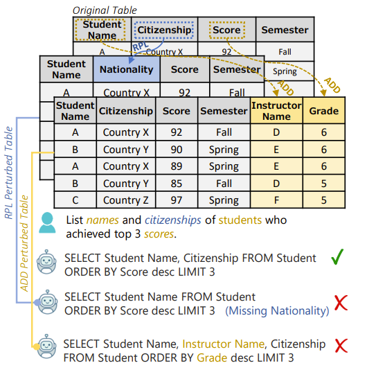
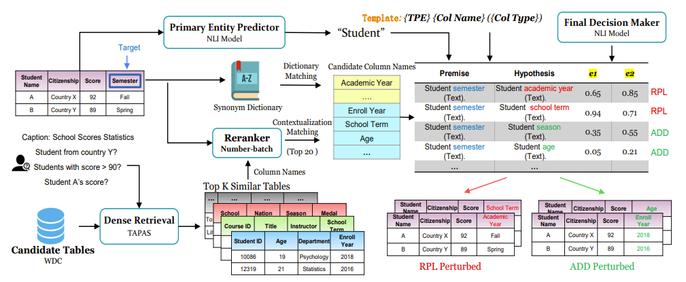

# Robustness of Text-to-SQL Models


## Introduction

This repository is the official implementation of our paper *Towards Robustness of Text-to-SQL Models Against Natural and Realistic Adversarial Table Perturbation*. In this paper, we curate **ADVETA**, the first robustness evaluation benchmark featuring natural and realistic adversarial table perturbation. To defend against this perturbation, we build a systematic adversarial training example generation framework **CTA**, tailored for better contextualization of tabular data. 

## ADVETA



We manually curate the **ADVE**rsarial **T**able perturb**A**tion
(ADVETA) benchmark based on three mainstream Text-to-SQL datasets, Spider, WikiSQL and WTQ. 
For each table from the original development set, we conduct RPL/ADD annotation separately, perturbing only table columns. We release our data in `adveta_1.0.zip` file.

## CTA



### Requirement

- python: 3.8
- cuda: 10.1
- torch: 1.7.1

install dependencies:

```bash
conda create -n cta python=3.8  -y
conda activate cta
conda install pytorch==1.7.1  cudatoolkit=10.1 -c pytorch -y
python -m spacy download en_core_web_sm
pip install -r requirements.txt
```

### Introduction

Contextualized Table Augmentation (CTA) framework as an adversarial training example generation approach tailored for tabular data. Before you run `pipeline.ipynb`, you should download data files and checkpoints from [Google Drive](https://drive.google.com/file/d/1HqP1P5QqytGZTM_Kx8Bbq0EuyKaD9raV/view?usp=sharing).

notes:
- We download number-batch word embedding from [here](https://conceptnet.s3.amazonaws.com/downloads/2019/numberbatch/numberbatch-en-19.08.txt.gz) as `./data/nb_emb.txt`.
- We pre-compute processed-WDC tables using Tapas dense retrieval models. Store output to `./wdc/wdc_dense_A.txt` and `./wdc/wdc_dense_B.txt` (Tapas have two encoders).

### Run
Just run the `pipeline.ipynb` and have fun.